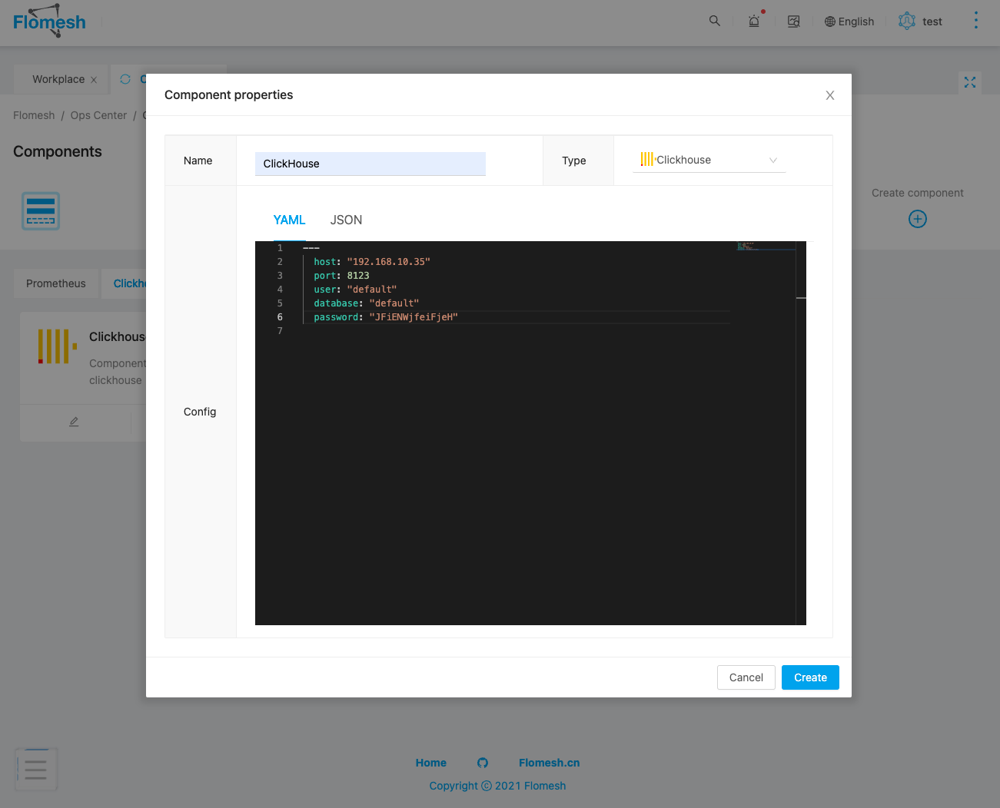
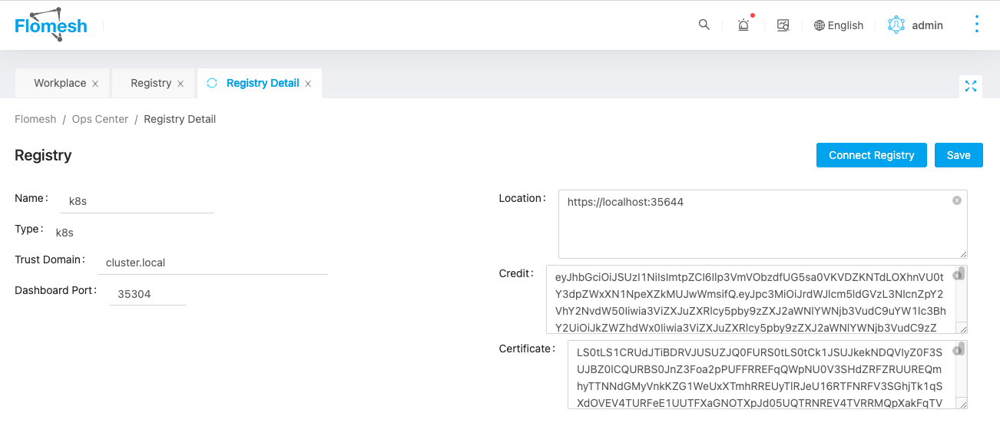

# Installation
## 准备
### 安装nodejs [(点击下载)](https://nodejs.org/en/download/releases/)
- Nodejs >= 14 , < 16

### 安装数据库
|        Database        |           Minimum            |      Recommended      |
| :-----------: | :-----------: | :--------: |
|  MySQL [(点击下载)](https://www.mysql.com/downloads/)   |        5.7.8        |     8.0             |
|  PostgreSQL [(点击下载)](https://www.postgresql.org/download/)   |          11.0         |            14.0       

### 配置环境变量
#### 数据库安装好后将连接信息配置到以下环境变量中
#### （或者直接修改数据库配置文件packages/server/config/database.js）

|        VAR        |           DESCRIPTION            |      VALUES      |
| :---------------: | :------------------------------: | :--------------: |
|  PIPY_REPO_HOST   |        PIPY repo location        |                  |
|  PIPY_REPO_PORT   |          PIPY repo port          |                  |
|   DATABASE_HOST   |          Database host           |                  |
|   DATABASE_PORT   |          Database port           |                  |
| DATABASE_USERNAME |        Database username         |                  |
| DATABASE_PASSWORD |        Database password         |                  |
|   DATABASE_TYPE   | Database type (default is mysql) | default,postgres |
|                   |                                  |                  |


## 本地运行
### 使用 `npm`
```bash
$ npm run setup
# 运行后端
$ npm run serve:server
# 运行前端
$ npm run serve:gui
``` 
### 使用 `yarn`
```bash
$ yarn setup
# 运行后端
$ yarn serve:server
# 运行前端
$ yarn serve:gui
``` 

## 组件安装及配置
### ClickHouse
- 安装 ClickHouse [(点击下载)](https://clickhouse.com/docs/en/quick-start/)
- 在GUI的组件中添加安装好的ClickHouse配置



|     VAR     |           DESCRIPTION            |
| :---------: | :------------------------------: |
|  host       |        ClickHouse host           | 
|  port       |        ClickHouse port           |
|  database   |        Database name             |
|  user       |        ClickHouse user           |
|  password   |        ClickHouse password       |


### K8s & DashBoard
- Install K8s [(点击下载)](https://kubernetes.io/docs/home/)
- 在注册中心添加K8s



|        VAR        |           DESCRIPTION            |
| :---------------: | :------------------------------: |
|  Name             |        Registry name             | 
|  Type             |        Registry type             |
|  Trust Domain     |        Registry Trust Domain     |
|  Location         |        K8s Api address           |
|  Credit           |        K8s Token                 |
|  Certificate      |        K8s CA cert               |

## Helm运行
参考 [Helm运行](../../charts/README.md)