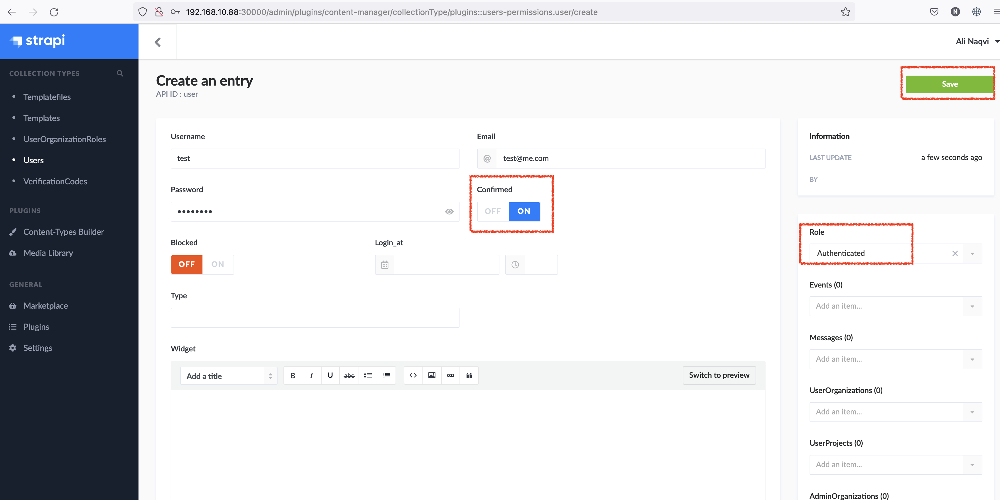
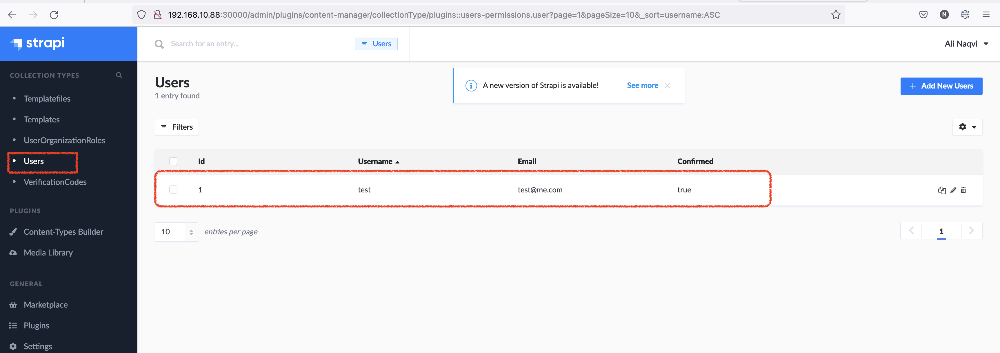
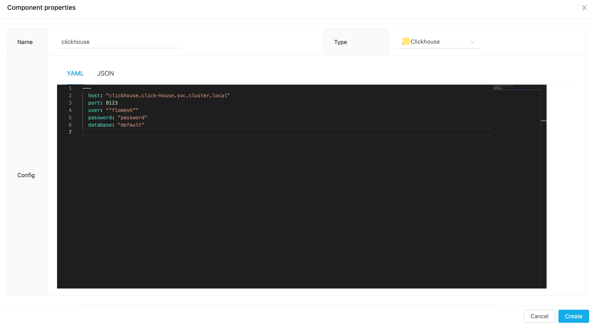
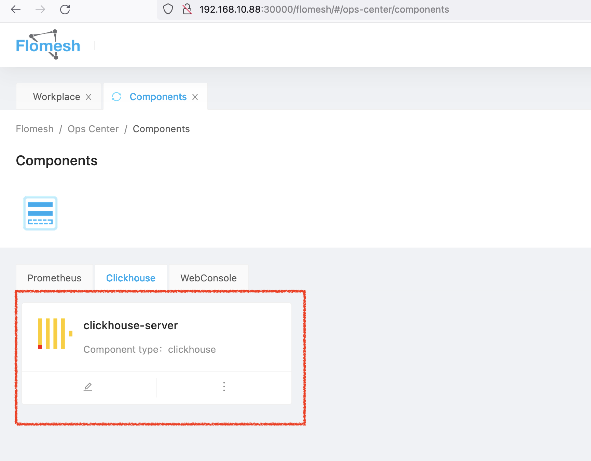
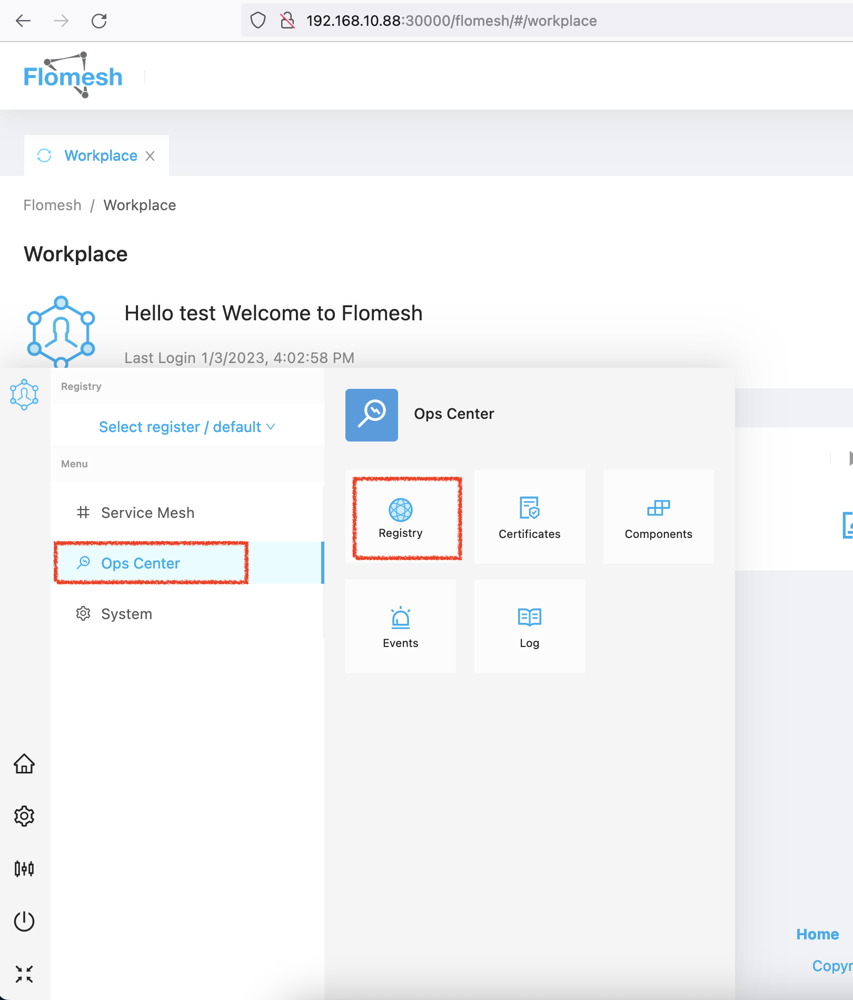
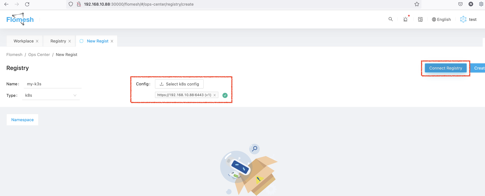
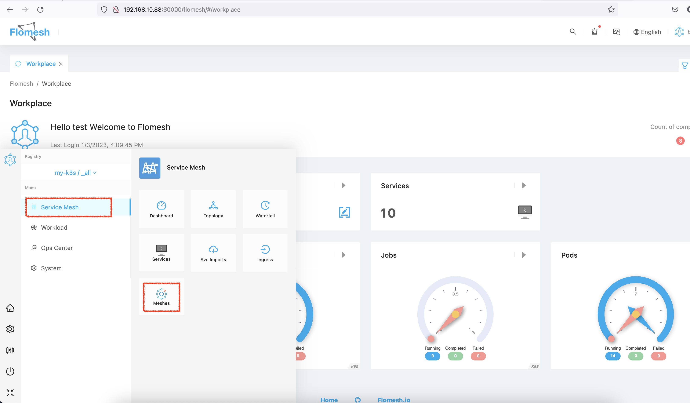
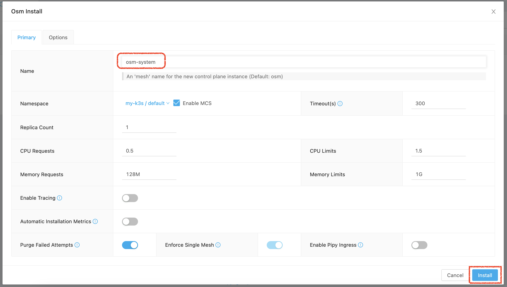

## Prerequisites

- Kubernetes  >= 1.19 
- Helm 3
- Mysql >= 5.7
- ClickHouse 

## Environment setup

### Setup K3s

```shell
export INSTALL_K3S_VERSION=v1.23.8+k3s2
curl -sfL https://get.k3s.io | sh -s - --disable traefik --write-kubeconfig-mode 644 --write-kubeconfig ~/.kube/config
```

### Setup Helm

```shell
curl https://raw.githubusercontent.com/helm/helm/main/scripts/get-helm-3 | bash
```

### Mysql

```shell
helm repo add bitnami https://charts.bitnami.com/bitnami
```

Install Mysql, set default `root` password to `root`, create a **database** `flomesh` with user `flomesh` and password `Flomesh1234`

```shell
helm install mysql bitnami/mysql  --namespace mysql --create-namespace  \
    --set auth.database=flomesh \
    --set auth.username=flomesh \
    --set auth.password=Flomesh1234 \
    --set auth.rootPassword=root
```

### Clickhouse

```shell
helm repo add bitnami https://charts.bitnami.com/bitnami
```

Install **Clickhouse** server with username `flomesh` and password `password`

```shell
helm install clickhouse bitnami/clickhouse --namespace click-house --create-namespace \
 --set auth.username=flomesh \
 --set auth.password=password \
 --set shards=1 \
 --set replicaCount=1 \
 --set zookeeper.enabled=false
```

## Install traffic-guru

```shell
helm repo add flomesh https://flomesh-io.github.io/helm-charts
```

```shell
helm install \
	--create-namespace \
	--namespace traffic-guru \
	traffic-guru \
	flomesh/traffic-guru \
	--set gui.tag=0.0.7-4 \
	--set database.host=mysql.mysql.svc.cluster.local \
	--set database.port=3306 \
	--set database.username=flomesh \
	--set database.password=Flomesh1234 \
	--set service.type=NodePort
```

## Create account

Get the access adress of Traffic Guru.

```shell
export NODE_PORT=$(kubectl get --namespace traffic-guru -o jsonpath="{.spec.ports[0].nodePort}" services traffic-guru)
export NODE_IP=$(kubectl get nodes --namespace traffic-guru -o jsonpath="{.items[0].status.addresses[0].address}")
echo http://$NODE_IP:$NODE_PORT/flomesh/
```

Open `http://$NODE_IP:$NODE_PORT/admin` in browser for administrator registration. Once administration account created, it will be redirected to admin console. Choose "Users" in sidebar, and create a new user account by clicking "Add New Users" button.

In entry creation page, input username, email, password and grant "Authenticated" role.



Once done, hit `Save` button to create user.



Open `http://$NODE_IP:$NODE_PORT/flomesh/#/login` again and login with account created above.

## Configure components

Configure components in Traffic Guru.

### Clickhouse

Go to "Ops Center | Components" in system menu, and clicck "+" button to create new components.



In pop-up window, choose type "Clickhouse" and attach content below in "Config" field.

```yaml
---
  host: "clickhouse.click-house.svc.cluster.local"
  port: 8123
  user: “flomesh”
  password: "password"
  database: "default"
```



### Registry

Execute command below and save output in file.

```shell
kubectl config view --raw | sed "s|127.0.0.1|$NODE_IP|g"
```

Go to "Ops Center | Registry" in system menu and click "+" button.



Create Kubernetes registry with uploading config file created above.



**Remember to refresh page.**

## Install mesh

Go to "Service Mesh | Meshes" in system menu. Click the "+" button to install mesh.



Let's create a new namespace `osm-system` in pop-up window and leave others as default. Then click "Install" button to proceed installation.



After few minutes, click the refresh button on "Meshes" tab or refresh whole page. You will find mesh installed successfully.


## More functions

Play with other functionality to get better understanding.